# Integrating Guardicore Assets into Microsoft Sentinel 

Author: Accelerynt

For any technical questions, please contact info@accelerynt.com

   

This playbook will give Microsoft Sentinel the ability to query your Guardicore Centra Cloud instance API to retrieve all installed assets. The API query will be sent every hour.

#
### Requirements

You will need the following items to enter in the playbook settings during deployment: 

* URL for your Guardicore instance. 

* A Username/Password that is a Local Administrator in your Guardicore environment. 

* The Microsoft Sentinel Workspace ID where you want the incidents logged. 

* The Primary or Secondary Key to your workspace. 

# 
### Setup

To retrieve the Guardicore instance URL needed for the deployment of this playbook, log into your account. Take note of the url, which will look like **https://cus-0000.cloud.guardicore.com** , where 0000 is your 4 digit customer number.

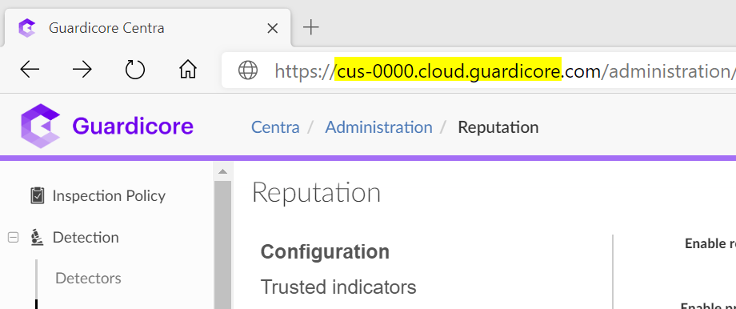

#
### Deployment                                                                                                         
                                                                                                        
To configure and deploy this playbook:
 
Open your browser and ensure you are logged into your Microsoft Sentinel workspace. In a separate tab, open the link to our playbook on the Accelerynt Security GitHub Repository:

https://github.com/Accelerynt-Security/Guardicore-Import-Assets

   

Click the “**Deploy to Azure**” button at the bottom and it will bring you to the custom deployment template.

In the **Project Details** section:

* Select the “**Subscription**” and “**Resource Group**” from the dropdown boxes you would like the playbook deployed to.  

In the **Instance Details** section:

* **Playbook Name**: This can be left as “Guardicore-Import-Assets” or you may change it.  

* **GCURL**: Enter your Guardicore tenant URL here. It must look like the following: **https://cus-0000.cloud.guardicore.com** 

Please ensure there is no **/** after the .com. 

* **GC Username**: Replace text with username of the Guardicore Admin account you want to use. 

* **GC Password**: Replace text with password of the Guardicore Admin account you want to use. 

Towards the bottom, click on “**Review + create**”. 

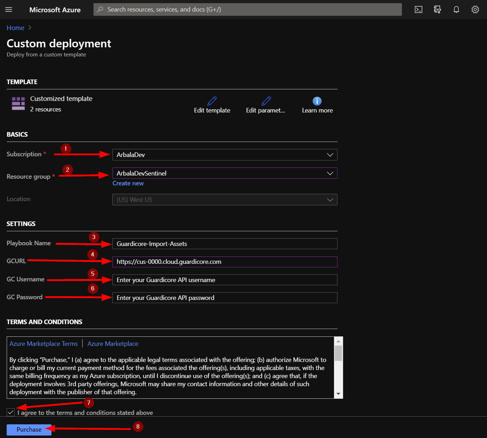

Once the resources have validated, click on "**Create**".

The resources should take around a minute to deploy. Once the deployment is complete, you can expand the "**Deployment details**" section to view them.
Click the one corresponding to the Logic App.

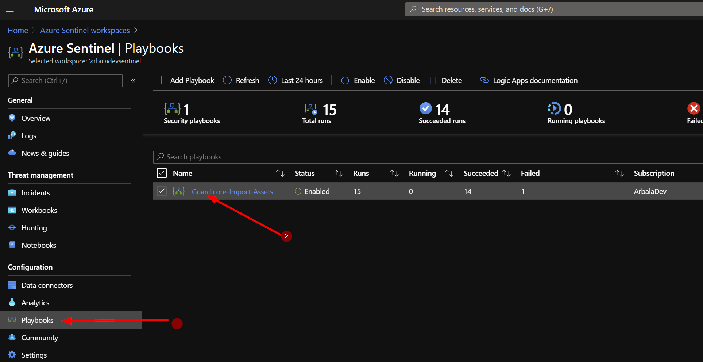

Click on the “**Edit**” button. This will bring us into the Logic Apps Designer.

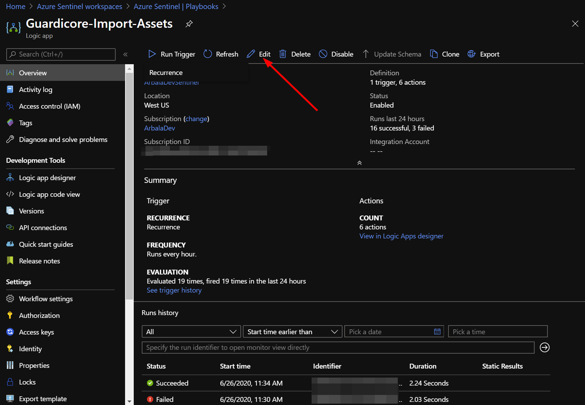

Click on the bottom bar labeled “**For Each Asset**”. 

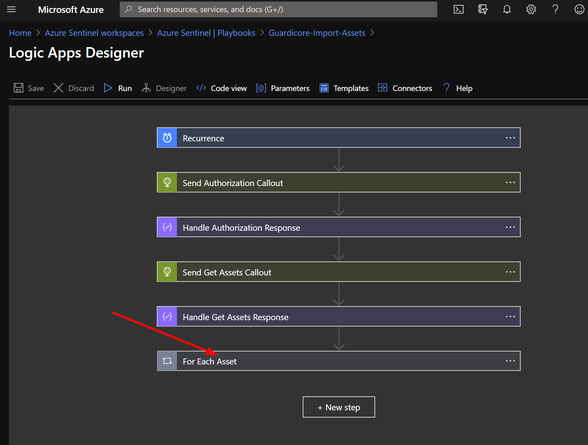

Click on “**Connections**”. This uses a connection created during the deployment of this playbook. Before the playbook can be run, this connection will either need to be authorized in this step, or an existing authorized connection may be alternatively selected. 

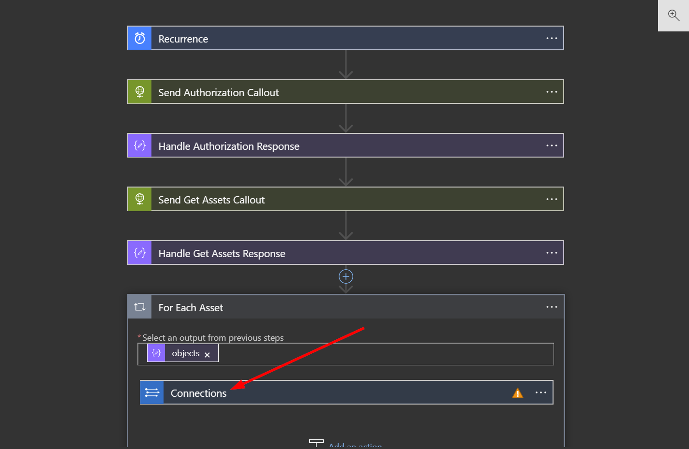

To validate the connection created for this playbook, expand the "**Connections**" step and click the exclamation point icon next to the name matching the playbook.

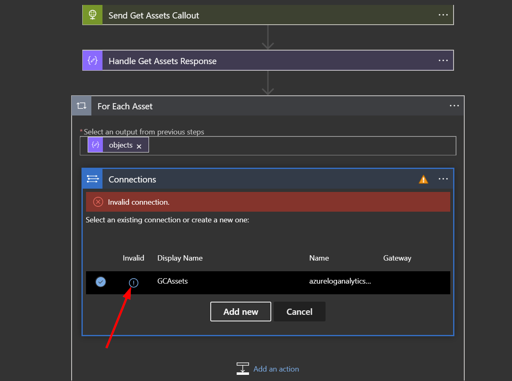

In the **Connection Name** put GCAssets. The next fields are **Workspace Key** (Primary or Secondary Key) and **Workspace ID**. Follow the instructions at the bottom of this page to find those values. Once you have them, copy and paste them into their respective fields. Now click the update button.  

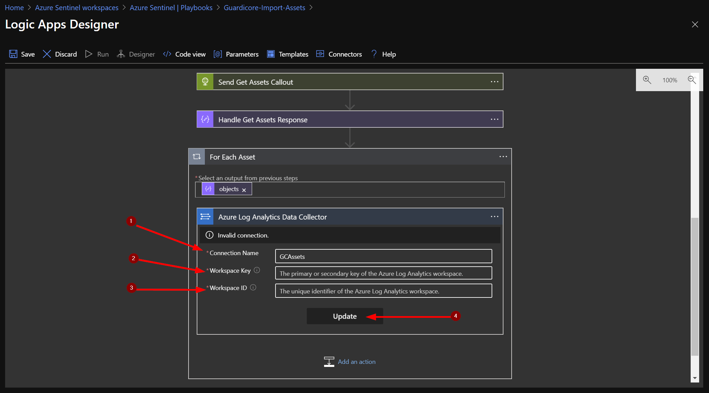

You should see the that the “**Send Data**” box has updated and displays “**Connected to GCAssets**.” Click the X to close the Logic App Designer. There is no need to click the save button.  

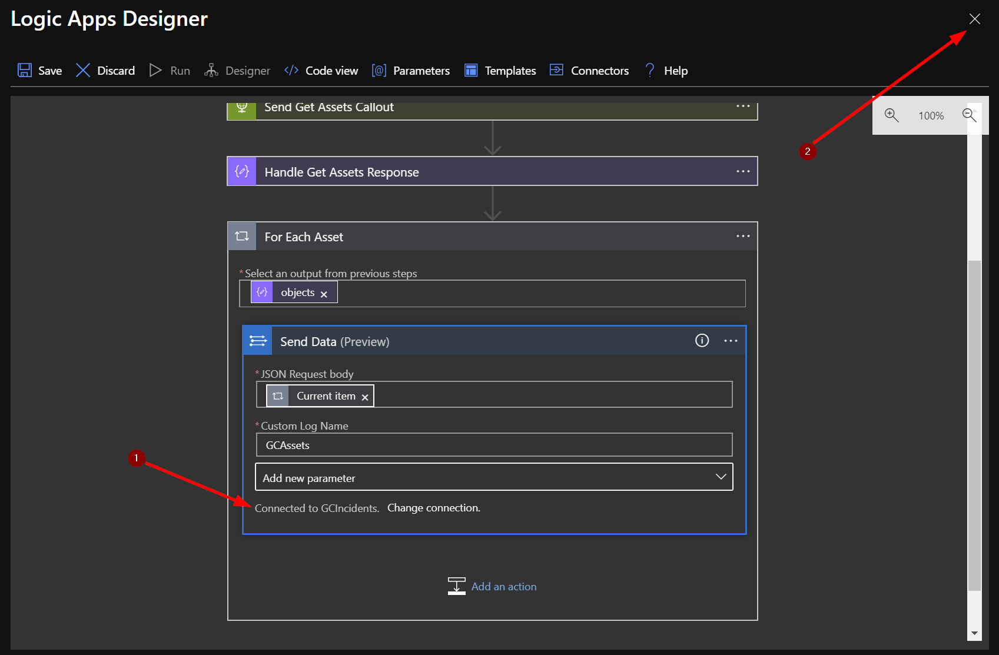

Back at your playbook overview we will want to manually run the playbook to grab the assets. Click on "**Run Trigger**" and the click the "**Recurrance**" tag that pops up below.

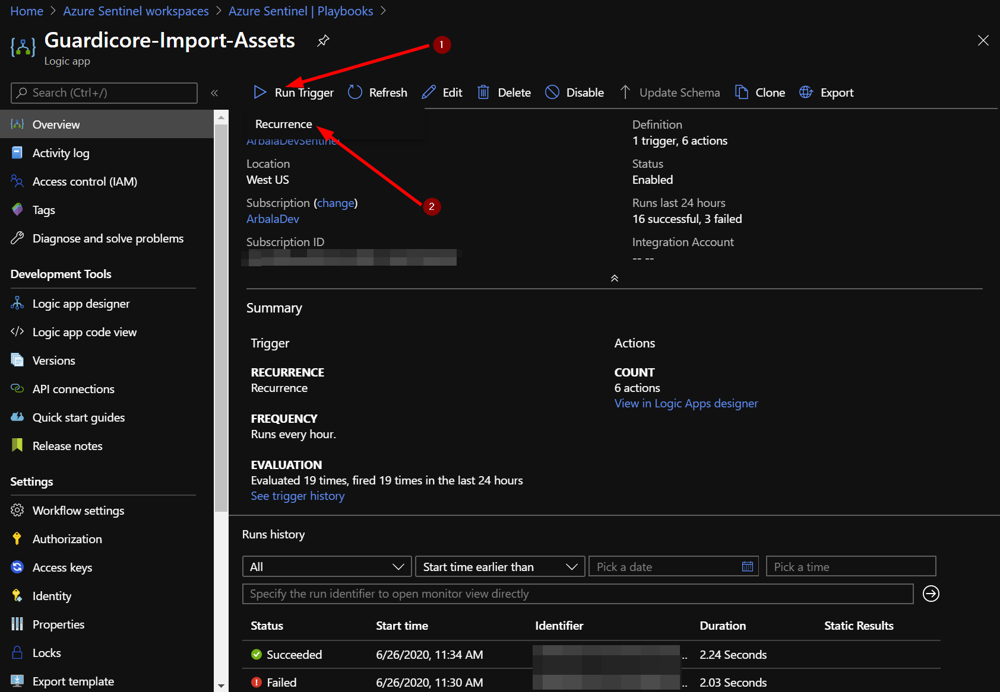

You should now have a table of your Guardicore assets and their properties in Sentinel. You can view the asset logs by returning to your Microsoft Sentinel workspace and clicking on “**Logs**”. You should have a new custom log called “**GCAssets_CL**” – type that into your query window and click run. Set the time frame for 1 hour. Each line returned contains the details for each individual asset returned from the Guardicore API. 

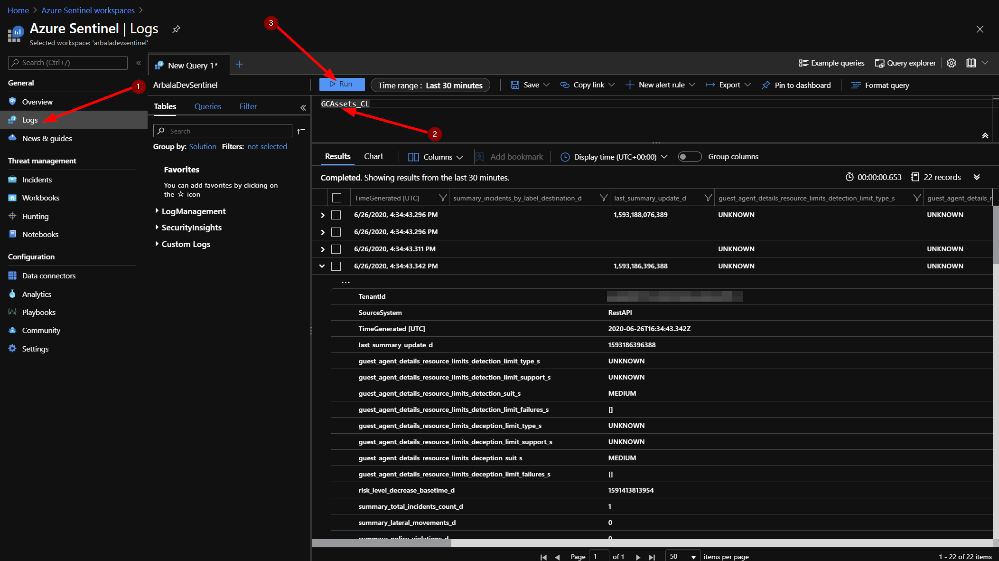

## Finding your Microsoft Sentinel Workspace ID and Primary/Secondary Key 

To find your Workspace ID and Primary/Secondary key, start by clicking on “**Settings**” from the Microsoft Sentinel workspace you want the incidents sent to. Then click on “**Workspace Settings**” under the Microsoft Search Bar. 

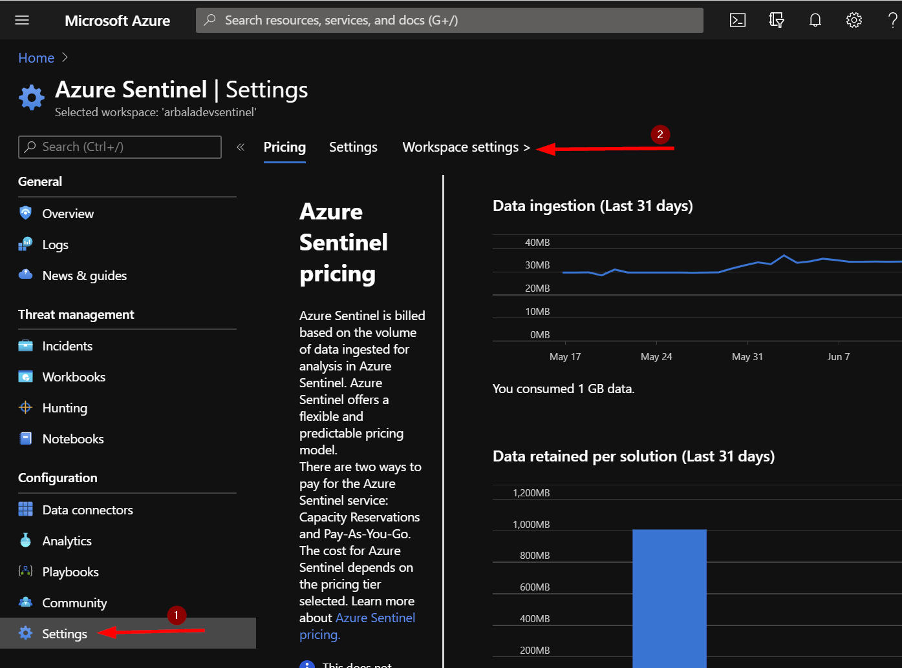

Click on “**Advanced Settings**”. 

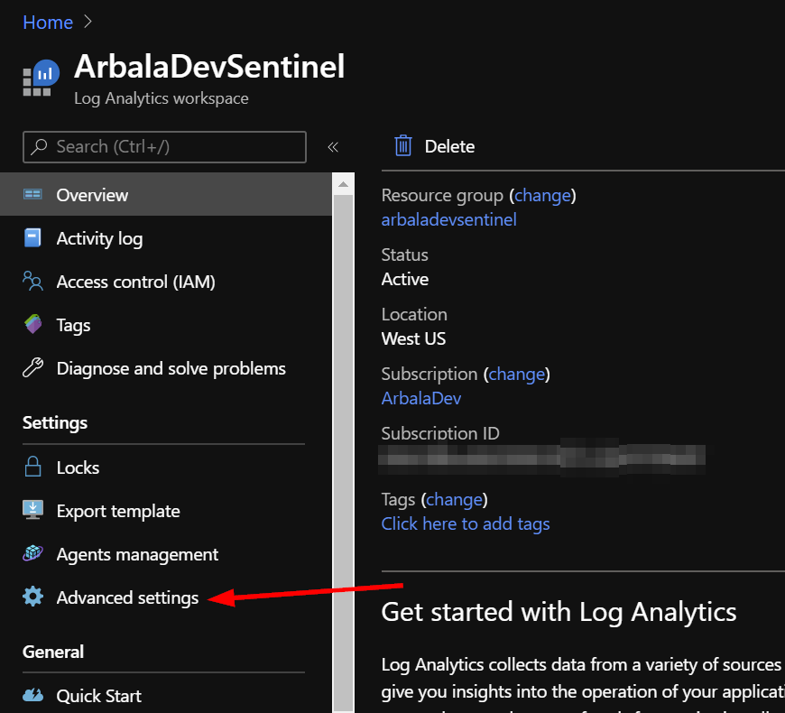

Next, click on “**Connected Sources**” and then “**Windows Servers**” to display your Workspace ID and either Primary or Secondary key. 

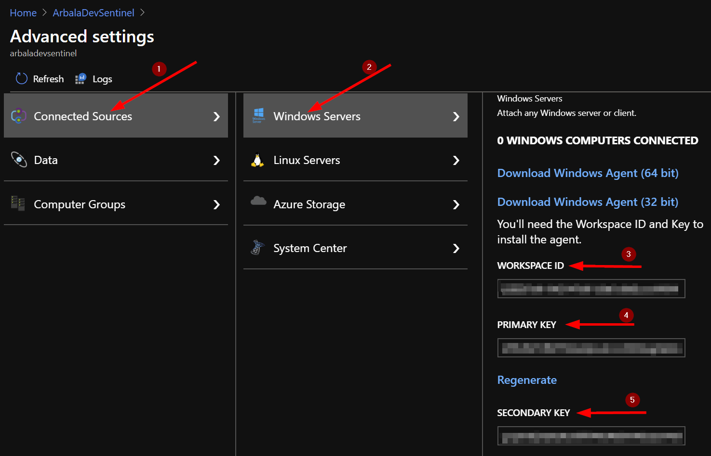
